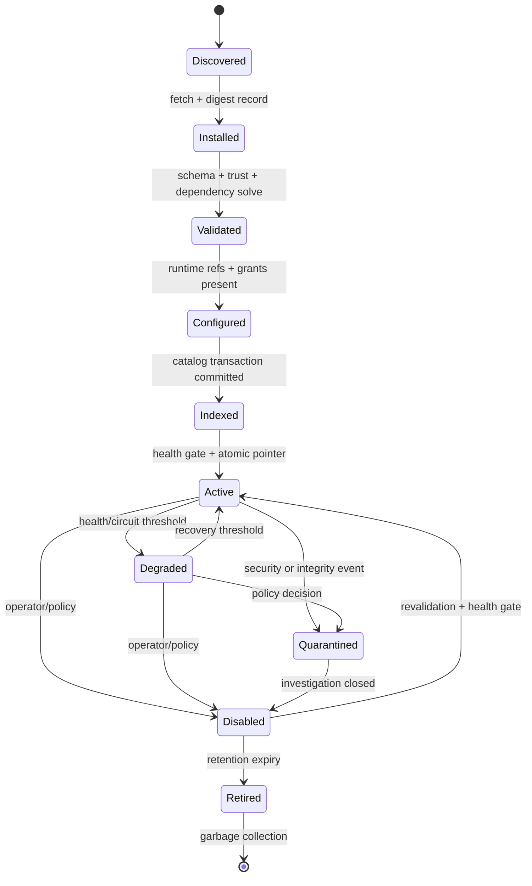

# CapSift Architecture

Status: proposed reference architecture  
Related discovery: `docs/requirements-discovery.md`

## 1. Purpose and design stance

CapSift is a policy-enforced, revision-aware gateway between AI clients and a potentially large catalog of Skills, MCP tools, CLI commands, HTTP APIs, and RAG sources. Its key optimization is **progressive disclosure**: models receive a tiny, stable meta-tool surface and load only the capability material needed for the current task.

The architecture optimizes end-to-end successful-task cost, not prompt size in isolation. It keeps four constraints visible in every decision:

- task quality and safety floors;
- hard token/context/reasoning budgets;
- deterministic governance and reproducibility;
- a self-hostable core with replaceable scale-out components.

It is not a general-purpose shell, arbitrary HTTP proxy, secret store, or agent framework. It can serve agent frameworks, but it owns capability cataloging, staged disclosure, policy, routing hints/decisions, execution mediation, and audit.

## 2. System boundaries

```mermaid
flowchart LR
    subgraph Clients["Clients"]
      IDE["IDE / coding agent"]
      Chat["Chat application"]
      CI["CI / automation"]
      SDK["SDK / embedded runtime"]
    end

    subgraph Hub["CapSift"]
      Adapters["MCP · HTTP · CLI · library adapters"]
      DP["Data plane: search · load · execute"]
      CP["Control plane: registry · policy · lifecycle"]
      Workers["Isolated provider workers"]
    end

    subgraph Providers["Providers"]
      Skills["Skill packages"]
      MCP["MCP servers"]
      CLI["CLI programs"]
      API["HTTP APIs"]
      RAG["RAG data sources"]
    end

    Clients --> Adapters
    Adapters --> DP
    Adapters --> CP
    DP --> CP
    DP --> Workers
    CP --> Workers
    Workers --> Providers
```



### Trust boundaries

1. Client input is untrusted, including model-generated arguments.
2. Capability manifests are untrusted until schema, provenance, and policy validation complete.
3. Provider output is untrusted and budget-bounded before it reaches a client or index.
4. Third-party driver code never runs in a control-plane process.
5. Tenant, principal, session, and request scopes are isolation boundaries, not metadata hints.

## 3. Control plane and data plane

### 3.1 Control plane

The control plane is the authoritative, low-throughput path for mutation and policy. Its components are:

| Component | Responsibility | Durable state |
|---|---|---|
| Registry service | Canonical identity, revisions, aliases, activation pointers | Manifests, digests, revision graph |
| Installer/resolver | Fetch, verify, dependency solve, lock, stage | Install records, dependency lock |
| Lifecycle controller | Valid transitions, health gates, rollout, rollback, quarantine | Desired/observed state, transition journal |
| Policy engine | Authorization, trust, approval, budget, routing, retention rules | Versioned policy bundles and decisions |
| Catalog indexer | Compact search documents and embeddings for capabilities | Catalog index revision |
| RAG index controller | Source connectors, chunking, ACL/freshness metadata | Source checkpoints and content index metadata |
| Secret broker adapter | Resolve logical secret references at execution | References only; secret values stay in backing store |
| Audit/config service | Append-only security events and effective configuration | Audit log, config revisions |

Control-plane mutations use optimistic concurrency (`resource_version`/ETag) and transactional outbox events. The database commit is authoritative; consumers reconcile idempotently. Search indexes are derived views, never the source of truth.

### 3.2 Data plane

The data plane is the latency-sensitive path:

| Component | Responsibility |
|---|---|
| Session gateway | Authenticate, negotiate features, establish tenant/principal/session scope |
| Search service | Hybrid retrieval, authorization filter, operational rerank, compact cards |
| Load service | Validate revision handle, select sections, expand dependencies, budget output |
| Execution admission | Validate arguments, pin revision, authorize, reserve budget, obtain approval |
| Router/budget coordinator | Choose eligible reasoning tier or emit hints; maintain task ledger |
| Execution supervisor | Dispatch to isolated workers, enforce deadline/resource limits, cancel |
| Result normalizer | Validate/sanitize provider output, redact, meter, stream, cache as permitted |
| Context residency manager | Track loaded sections, pin dependencies, evict and rehydrate |

The data plane reads immutable snapshots of registry and policy state. It cannot directly mutate activation or permissions. A request records the registry revision and policy revision used for its decision.

## 4. Capability model

### 4.1 Common envelope

Every capability has:

- canonical coordinate: `namespace/name`;
- semantic version and content digest;
- kind and driver protocol/version;
- short discovery card and optional aliases/tags;
- operations and their input/output contracts;
- requested permissions and side-effect class;
- dependencies, conflicts, runtime requirements, and health probe;
- provenance, trust evidence, cost/latency hints, and owners;
- section descriptors for progressive loading;
- tenant visibility and data classification.

Kind-specific behavior is delegated to a driver:

| Kind | Typical operations | Driver boundary |
|---|---|---|
| Skill | `expand`, optionally `execute` | Resolve instruction sections/assets; orchestrate declared dependencies |
| MCP | `describe`, `execute` | Manage MCP session and invoke a pinned server tool |
| CLI | `execute` | Build an argv array, never shell interpolation; supervise process |
| API | `execute` | Construct allowlisted request; validate response schema |
| RAG | `retrieve`, `expand` | Query tenant index/source and return cited, bounded passages |

### 4.2 Manifest example

```yaml
apiVersion: capabilityhub.io/v1alpha1
kind: Capability
metadata:
  namespace: community
  name: issue-search
  version: 1.4.2
  digest: sha256:4b2f...
  labels: { domain: engineering }
spec:
  type: api
  summary: Search authorized issue trackers with structured filters.
  driver:
    name: http-openapi
    version: ">=1.2 <2"
    configRef: artifact://openapi/issues.yaml
  operations:
    - name: search
      inputSchemaRef: "#/schemas/SearchInput"
      outputSchemaRef: "#/schemas/SearchResult"
      sideEffect: none
      idempotency: intrinsic
  sections:
    contract: { ref: artifact://sections/contract.json, tokens: 420 }
    guidance: { ref: artifact://sections/guidance.md, tokens: 680 }
    examples: { ref: artifact://sections/examples.md, tokens: 900 }
  permissions:
    network:
      hosts: [issues.example.org]
      methods: [GET]
    secrets: [issues.read_token]
    data: [tenant_internal]
  dependencies:
    - coordinate: core/oauth-broker
      version: "^2.0"
      optional: false
  conflicts:
    - type: projection_name
      value: issue_search
  trust:
    source: https://registry.example.org/community/issue-search
    publisher: did:web:example.org
    signatureRef: artifact://signatures/manifest.sig
  cost:
    expectedLatencyMs: 350
    outputTokensP50: 300
    outputTokensMax: 2000
```

Unknown optional extension fields are preserved. Unknown required operations, permissions, or security semantics fail validation. Secrets are logical references only. Artifact references resolve by digest within the installed package, not by a mutable remote URL during execution.

### 4.3 Persistent records

The reference implementation can use SQLite locally and PostgreSQL in shared deployments behind the same repository interface. Minimum records are:

- `capability`, `revision`, `artifact`, `dependency_lock`, `activation`;
- `desired_state`, `observed_state`, `health_sample`, `transition_event`;
- `policy_bundle`, `trust_record`, `permission_grant`;
- `catalog_index_revision`, `rag_source`, `rag_checkpoint`;
- `task_ledger`, `execution_admission`, `approval`, `idempotency_record`;
- `audit_event`, with payload-free operational telemetry stored separately.

Artifacts are content-addressed. Audit records are append-only. Private results and secret material are never stored in these tables.

## 5. Lifecycle



Transitions are journaled, idempotent where feasible, and protected by resource version. Installation does no provider execution except in an isolated validation worker. Activation is an atomic pointer change after validation, indexing, permission resolution, and health checks. In-flight execution remains pinned to its admitted revision; disabling blocks new admission and follows policy to drain or cancel current work.

Updates are side-by-side revisions:

1. fetch and verify immutable artifacts;
2. validate manifest, trust, contracts, and dependency lock;
3. configure references and effective grants;
4. index the candidate without making it searchable to ordinary callers;
5. run isolated health/conformance checks;
6. atomically move the activation pointer;
7. monitor a health window and roll back automatically on threshold breach.

Quarantine is fail-closed and immediately removes a revision from search and new admissions. Garbage collection preserves revisions referenced by in-flight work, audit retention, or rollback policy.

## 6. Meta-tool protocol

The model-visible contract is intentionally stable and small. Adapters may rename tools for local conventions, but semantics are identical.

### 6.1 `capability.search`

Input:

```json
{
  "intent": "find recent payment failures",
  "kinds": ["api", "rag"],
  "filters": {"side_effect": "none"},
  "limit": 8,
  "budget": {"max_output_tokens": 900},
  "task_id": "tsk_..."
}
```

Search performs lexical + semantic retrieval over compact catalog documents, filters by tenant/principal policy and health, then reranks by relevance, trust, availability, estimated cost, latency, and session reuse. It returns cards rather than schemas:

```json
{
  "results": [{
    "ref": "capref_opaque_revision_bound",
    "id": "community/issue-search",
    "revision": "1.4.2@sha256:4b2f...",
    "kind": "api",
    "summary": "Search authorized issue trackers with structured filters.",
    "operations": ["search"],
    "risk": "read_only",
    "trust": "verified_publisher",
    "cost_hint": {"output_tokens_p50": 300, "latency_ms_p50": 350},
    "match_reason": ["intent", "domain:engineering"]
  }],
  "index_revision": "idx_...",
  "truncated": false,
  "budget": {"used_tokens": 164}
}
```

Unauthorized results are filtered before ranking so scores and cardinalities do not leak their existence. Stable tie-breaking uses coordinate plus revision for a fixed index and policy revision.

### 6.2 `capability.load`

Input includes an opaque `ref`, desired `sections` (`contract`, `guidance`, `examples`, `references`), operation names, and a hard response budget. The service verifies the ref, revision availability, current authorization, and section ACL; resolves mandatory dependencies/conflicts; and returns only the requested slices.

The response includes:

- the executable contract and normalized operation identifiers;
- an `execution_ref` bound to revision, actor scope, policy revision, and expiry;
- dependency and conflict notices;
- permission/approval preview;
- actual/estimated budget use and omitted-section handles.

Loading never grants permission and never executes provider code. If a contract cannot fit the hard budget, the call fails with `budget_too_small` and reports the minimum safe size instead of returning a malformed partial schema.

### 6.3 `capability.execute`

Input requires `execution_ref`, operation, structured arguments, task ID, deadline, budget, and optional idempotency/approval tokens. Admission proceeds in this order:

1. authenticate and validate bound reference/revision;
2. schema-validate and size-limit arguments;
3. resolve effective permissions against normalized arguments;
4. obtain or validate exact-intent approval when required;
5. reserve token, monetary, time, and concurrency budget;
6. pin revision and persist admission/idempotency state;
7. dispatch to the isolated provider worker;
8. validate, sanitize, redact, meter, and stream/buffer output;
9. commit outcome and release/reconcile reservation.

RAG uses operation `retrieve` with query, top-k, filters, and output budget. It returns bounded passages with source identity, revision/freshness, offsets, and expansion handles.

### 6.4 Direct projection optimization

Some clients require native tool schemas. After `load`, an adapter MAY project a selected contract as a temporary direct tool. Projection is session-scoped, revision-bound, included in the same context budget, and automatically evicted. Direct projection never bypasses execution admission.

## 7. Reasoning-tier router

The router is a policy component, not an opaque prompt heuristic. It supports two modes:

- **authoritative:** it selects a client-configured model/tier endpoint;
- **advisory/pass-through:** it returns a tier recommendation or records the client’s choice when model selection lives outside the hub.

### 7.1 Inputs

- task classification and explicit quality/latency/cost objective;
- uncertainty signals: close search scores, schema ambiguity, missing information;
- risk floor: side-effect class, sensitive data, policy-required minimum tier;
- complexity signals: dependency depth, number of operations, contract size;
- task ledger: prior attempts, normalized error classes, evidence delta;
- remaining token, monetary, latency, and escalation budget;
- endpoint health, availability, and supported features.

### 7.2 Selection and escalation

Policy first removes ineligible tiers. Among eligible tiers, the router minimizes predicted total task cost subject to success and latency constraints. A simple auditable reference score is:

`score(tier) = predicted_cost + λ_latency × predicted_latency + λ_failure × predicted_failure_penalty`

Risk minimums and hard budgets are constraints, not score weights. The selected tier record includes input feature categories, policy revision, eligible set, reason codes, prediction version, and budget impact—never hidden chain-of-thought.

Escalation is allowed only for an explicit reason such as low selection margin, contract interpretation failure, policy-mandated review, or a retryable failure with new evidence. The task ledger hashes normalized attempts. Repeating an equivalent action with no evidence delta consumes a retry counter and terminates at the configured cap with `no_progress`. De-escalation can occur after a high-tier planner produces a bounded executable plan.

Cold start uses deterministic rules; telemetry-trained predictors are optional and shadow-tested before activation. A policy kill switch selects a fixed tier. Router decisions are replayable from privacy-safe features.

## 8. Budgets and context residency

### 8.1 Hierarchical ledger

Budgets exist at organization/tenant, principal, task, phase, call, and context-slot levels. Dimensions include:

- input/output tokens and estimated context occupancy;
- model/reasoning tier calls and escalation count;
- monetary cost, wall-clock deadline, tool calls, and retries;
- provider output bytes, RAG passages, and concurrent executions.

Every costly operation follows reserve → execute → reconcile. Hard budgets cannot be exceeded; soft thresholds trigger smaller result sets, summaries, cache reuse, or tier changes. At task start, the ledger reserves protected headroom for model response, errors, and safety/approval messages so tool output cannot consume the entire window.

Provider streaming passes through a counting limiter. At the hard boundary the hub cancels upstream when possible and returns a syntactically valid truncated envelope with a continuation handle only when the operation contract permits pagination. It never slice-truncates JSON or safety-critical contracts.

### 8.2 Residency and eviction

The server artifact cache and the model’s active-context inventory are separate:

- artifact cache stores immutable authorized sections by digest and scope;
- context inventory records which sections the client has received, their size, pins, sensitivity, and rehydration handles.

Pinned entries include current execution contracts, unresolved approval context, explicit user pins, and mandatory dependency contracts. Other entries receive an eviction value:

`value = reuse_probability × reload_cost × trust_freshness / (size × sensitivity_penalty)`

The lowest value is evicted first, with recency as a tie-breaker. Exact weights are configuration and benchmark outputs, not API guarantees. Eviction returns/retains a compact digest-bound handle so immutable content can be rehydrated. Sensitive or principal-private sections are memory-only by default and zeroed/expired according to policy.

Eviction events include reason, bytes/tokens freed, pins considered, and digest—never content. If all residents are pinned and the budget is insufficient, the hub fails with `context_budget_exhausted` rather than silently discarding required state.

## 9. Permissions, approval, and secrets

### 9.1 Policy decision

Authorization evaluates:

`subject × tenant × session × capability revision × operation × normalized arguments × environment × time`

Requested manifest permissions are upper bounds, not grants. Effective permissions are the intersection of requested scopes, administrator policy, caller grants, environment constraints, and dependency scopes. Dependency execution cannot inherit more authority than the parent call.

Permission namespaces cover:

- filesystem paths and read/write/create/delete modes;
- network hosts, ports, protocols, and HTTP methods;
- process execution, executable digest, environment variables, and resource limits;
- named secret references and scopes;
- data classifications and tenant/source ACLs;
- side-effect classes and control-plane operations.

### 9.2 Approval

Policy returns allow, deny, or approval-required. Approval tokens bind capability digest, operation, normalized argument digest, subject, tenant, expiry, policy revision, and side-effect summary. They are single-use by default for non-idempotent actions. A client that did not negotiate approval UI receives a structured denial with a safe next action.

### 9.3 Secret flow

The manifest names logical secrets. After admission, the supervisor requests an ephemeral, minimum-scope value from the secret broker and injects it through a driver-specific out-of-band channel. The value is excluded from arguments, environment dumps, result caches, catalog/RAG indexes, audit payloads, and traces. Redaction uses both known-secret matching and field classification, but redaction is defense in depth; avoiding capture is primary.

## 10. Conflict and dependency handling

Installation resolves typed dependency graphs to an immutable lock. The resolver checks cycles, version constraints, runtime availability, driver interface version, permissions introduced by dependencies, and environment compatibility.

Conflict types include:

- canonical identity/version;
- model projection/tool name;
- CLI executable or exclusive process resource;
- HTTP route/host policy;
- port, socket, or filesystem ownership;
- incompatible dependency constraints;
- manifest-declared semantic exclusivity.

Resolution is deterministic and recorded in an explanation graph. Policy may:

- reject activation;
- select an explicit preferred provider/revision;
- namespace client projection names;
- place providers in separate isolation pools;
- allow coexistence when exclusive resources can be remapped.

Load order is never a conflict policy. Semantic conflicts that cannot be mechanically proven safe require an administrator decision. The chosen resolution is revisioned and included in the activation record.

## 11. Provider isolation and failure containment

The execution supervisor maintains pools keyed by trust tier, tenant policy, driver, and optionally capability revision. Isolation levels are configurable:

1. remote provider with authenticated, restricted connection;
2. dedicated container/sandbox for untrusted local providers;
3. separate OS process with restricted identity for trusted local providers;
4. in-process only for built-in, audited normalization code—not third-party drivers.

Each invocation has deadline, cancellation token, CPU/memory/output/concurrency limits, network/filesystem policy, and correlation ID. CLI arguments are passed as arrays; shell parsing is disabled unless a separately governed shell capability explicitly requires it. API destinations are resolved against allowlists and protected against redirect/DNS rebinding policy violations.

Circuit breakers operate per provider revision and operation, not globally. Health state uses thresholds and hysteresis to avoid flapping. Crash, timeout, malformed output, auth failure, policy denial, resource exhaustion, and upstream unavailability map to distinct error types. Retries require idempotency guarantees and exponential backoff with jitter under the task deadline.

Control services continue when a provider crashes. If registry or policy connectivity is lost, authorization and unverified execution fail closed. Bounded stale, signed immutable catalog snapshots may remain searchable if policy allows, and responses identify the snapshot age. RAG ACL uncertainty always fails closed.

## 12. Multi-client architecture

All transports map to the same internal operations and conformance tests:

- **MCP server:** exposes the three meta-tools and optional temporary projection;
- **HTTP/JSON API:** REST-style lifecycle endpoints plus streaming data-plane endpoints;
- **CLI:** administrative commands and a scriptable data-plane client with JSON output;
- **library interface:** embedded local use with the same authorization/budget contracts.

Handshake advertises protocol version, streaming, cancellation, approval UI, temporary projection, model-tier control, maximum message size, and continuation support. Capability references are opaque to clients. Auth identity is converted to a common principal context before business logic.

Streaming has explicit sequence numbers and terminal outcome. Cancellation propagates to providers. Reconnection resumes only operations whose contract supports it; it never guesses whether a side effect completed. Equivalent requests across adapters must yield equivalent policy, revision, and error outcomes.

## 13. RAG subsystem

RAG separates source management from retrieval execution:

- source connector discovers changes using checkpoint/cursor;
- parser/classifier assigns tenant, ACL, sensitivity, and provenance;
- chunker produces content-addressed chunks with document/offset lineage;
- embedder and lexical indexer write a new index revision;
- atomic pointer publishes the revision after validation;
- retrieval applies tenant/source ACL before ranking, deduplicates, reranks, and budgets passages.

Catalog search and RAG content use distinct logical indexes and authorization paths. Retrieval results contain source identifier, document revision, chunk/offset, freshness time, score explanation category, and an expansion handle. Whole-document expansion requires a separate budget and authorization check. Deletion/ACL events tombstone results immediately in the authorization layer even if physical index compaction is asynchronous.

Prompt-injection-resistant handling treats retrieved text as untrusted data. Drivers label provenance and do not reinterpret document instructions as hub policy. Content is never permitted to add permissions or alter the capability reference.

## 14. Observability and audit

### 14.1 Correlation model

Every request receives `trace_id`, `task_id`, `session_id`, `request_id`, and, when applicable, `execution_id`. Events also record tenant-safe identifiers, capability coordinate/digest, provider revision, catalog/policy revision, client adapter, and route decision reason codes.

### 14.2 Metrics

Minimum metrics include:

- search/load/execute counts, latency distributions, result counts, cache hit rate;
- capability selection rank, load-to-execute conversion, provider health/circuit state;
- estimated/actual tokens, context residency, evictions, rehydrates, output truncations;
- reasoning tier distribution, escalation, retries, no-progress terminations;
- authorization allow/deny/approval, approval latency/expiry;
- errors by taxonomy/blame domain and idempotency deduplication;
- RAG freshness, indexing lag, ACL-filter counts, cited-passage use;
- lifecycle transition duration, rollback, quarantine, dependency conflict.

### 14.3 Traces, logs, and audit

Distributed spans follow adapter → search/load/admission → policy/budget → supervisor → driver. Default logs contain structured metadata, sizes, hashes, classifications, and reason codes—not prompts, arguments, provider bodies, retrieved passages, or secrets. Debug payload sampling requires explicit policy, redaction, short retention, and tenant consent.

Security audit events are append-only and cover installs, trust evidence, grants, policy changes, approvals, executions, denials, quarantine, and secret reference access. Export and retention are configurable. Audit integrity can be strengthened with hash chaining or external immutable sinks.

## 15. Error contract

All adapters preserve a stable envelope:

```json
{
  "error": {
    "code": "approval_required",
    "category": "policy",
    "retryable": false,
    "safe_message": "This operation needs approval for the exact proposed change.",
    "correlation_id": "req_...",
    "details": {"challenge": "apc_...", "expires_at": "..."}
  }
}
```

Top-level categories are `input`, `reference`, `policy`, `approval`, `budget`, `conflict`, `provider`, `dependency`, `timeout`, `cancelled`, and `internal`. Internal/provider diagnostic detail is retained in restricted telemetry and is not exposed to the model. Retryability is determined by the hub, and replay of side effects additionally requires an idempotency record.

## 16. Deployment profiles

### Local/reference

- one control/data-plane service process;
- embedded SQLite plus local lexical/vector index;
- content-addressed artifact directory;
- separate supervised provider processes;
- local policy files and pluggable OS/external secret broker.

This profile runs core features without a proprietary dependency and supports offline use after artifacts are acquired.

### Shared/service

- replicated stateless gateways and data-plane services;
- PostgreSQL-compatible authoritative store;
- external object storage and pluggable vector/lexical indexes;
- queue/event bus for indexing and reconciliation;
- sandbox/container worker pools;
- external policy and secret backends where desired.

Leader election or database leases serialize lifecycle reconciliation per capability, while execution scales horizontally. The protocols and manifest remain identical across profiles.

## 17. Reference service objectives and capacity assumptions

Initial, explicitly revisable targets for published benchmark hardware:

- 10,000 active capability revisions per instance;
- 1,000,000 RAG chunks per tenant;
- 100 concurrent executions per worker node;
- search p95 below 150 ms and load-from-cache p95 below 75 ms;
- no hub-wide outage from a single provider crash;
- zero authorization bypass, cross-tenant result, or secret-capture findings in release gates.

Provider time is reported separately from hub overhead. Benchmarks disclose hardware, cold/warm state, catalog/index size, concurrency, tenant count, and percentile distributions. Capacity failure returns backpressure with retry guidance rather than accepting unbounded queues.

## 18. Verification strategy

### Contract and conformance

- manifest schema/version fixtures, including unknown security semantics;
- one driver conformance suite per capability kind;
- identical meta-tool behavior across MCP, HTTP, CLI, and library adapters;
- deterministic dependency and conflict fixtures;
- structured error compatibility and revision pinning tests.

### Security

- permission matrix and dependency privilege-intersection tests;
- exact-intent approval mutation/replay tests;
- artifact tamper, dependency confusion, signature/trust policy tests;
- secret canaries across prompts, logs, traces, cache, audit, and errors;
- tenant/cache isolation, SSRF/redirect/DNS, path traversal, shell injection tests;
- untrusted RAG prompt-injection and ACL deletion tests.

### Resilience

- provider crash/hang/memory/output flood/malformed protocol fault injection;
- registry, policy, index, secret broker, network partition, and stale-cache scenarios;
- update under load, atomic switch, drain/cancel, health rollback, restart recovery;
- idempotency under timeout and duplicate delivery.

### Efficiency and quality

A versioned task corpus compares CapSift to eagerly exposing all tools. Per scenario, report success, selection accuracy, visible tokens, peak context, tool calls, reasoning-tier usage, cost, latency, retries, and truncation. Release thresholds operate by task class and tail percentile, not aggregate mean alone.

## 19. Suggested implementation sequence

1. Specify the manifest, immutable registry, driver interface, and three meta-tool contracts.
2. Implement local control plane, catalog search, staged load, revision-bound references, and budget ledger.
3. Add isolated MCP/CLI/API drivers, admission policy, approval, idempotency, and structured errors.
4. Add skill section expansion and RAG indexing/retrieval with source ACLs and citations.
5. Add lifecycle rollout/rollback, conflict resolver, cache residency/eviction, and full telemetry.
6. Introduce deterministic reasoning-tier rules, replay benchmark, then optional learned predictions in shadow mode.
7. Add shared deployment adapters only after the single-node conformance and failure suites pass.

This sequence proves the product’s defining claim—bounded progressive capability disclosure under governance—before adding distributed infrastructure or predictive routing complexity.

## 20. Architecture decision checkpoints

The following values are configuration defaults pending evidence, not fixed protocol semantics: search top-k, compact-card token size, routing thresholds, eviction weights, cache TTLs, benchmark capacity, and health/circuit thresholds. The following are invariants: plane separation, immutable revision pinning, deny-by-default execution, exact-intent approval, out-of-band secrets, budget enforcement, tenant isolation, structured errors, third-party worker isolation, and observable policy decisions.
